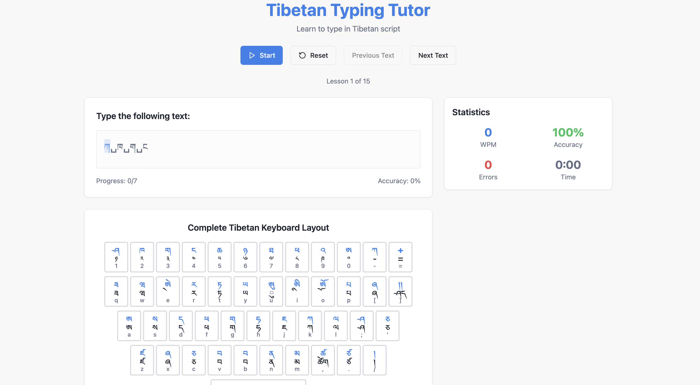

# Tibetan Typing Tutor

**Tibetan Typing Tutor** is a modern web-based application designed to help users learn and improve their Tibetan typing skills. Built with React, TypeScript, and Tailwind CSS, the app offers a clean user interface, real-time feedback, and customizable practice sessions.

##  Tech Stack

- **React** – Component-based UI development
- **TypeScript** – Static typing for robust and maintainable code
- **Vite** – Fast and efficient development environment
- **Tailwind CSS** – Utility-first CSS for rapid styling
- **shadcn/ui** – Accessible and customizable UI components

---

##  Getting Started

Follow the steps below to set up the project locally:

### 1. Clone the Repository


```bash
git clone https://github.com/TenzinSherab/tibetan-typing-tutor.git
cd tibetan-typing-tutor
```
### 2.Install dependencies


```bash
npm install
```

### 3.Start the Development Server
```bash
npm run dev
```

## Screenshot

Here is a preview of the Tibetan Typing Tutor interface:




